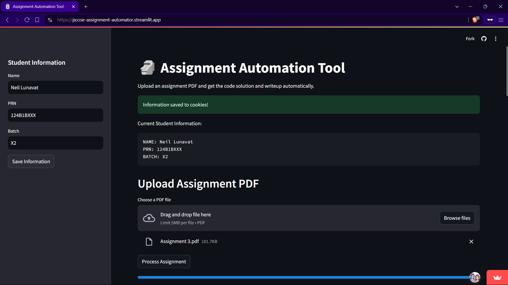
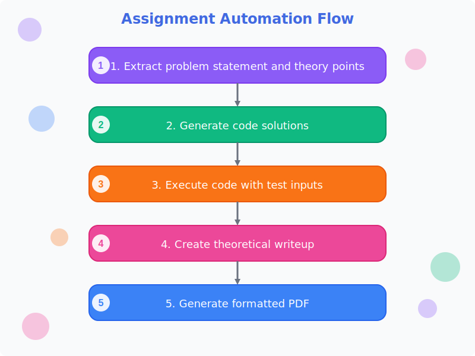
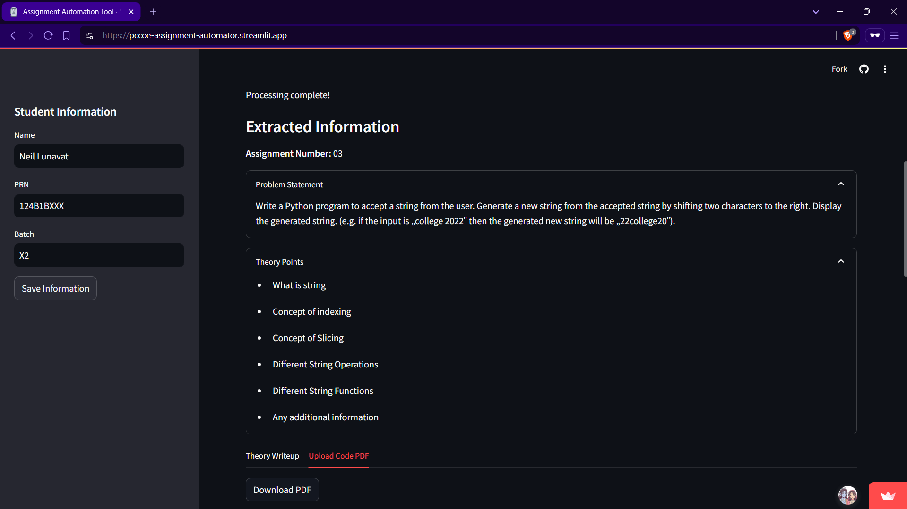
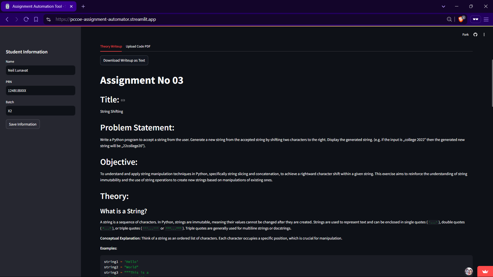

# 🗿 Assignment Automation Tool

<p align="center">
  
</p>

## The End of Late-Night Assignment Panic™

Assignment Automation Tool transforms the entire assignment completion process from a multi-hour existential crisis into a **two-minute breeze**. Upload your assignment PDF, and watch as AI magically handles the rest—from generating working code to creating a perfectly formatted submission document that would make your professor shed a tear of joy.

## 🧠 How It Works

<p align="center">
  
</p>

## 🚀 What This Beast Can Do

-   **One-Click Problem Analysis** - Gemini AI extracts problem statements and theory points from your PDF
-   **Code Generation** - Get working Python or C++ code that actually solves your assignment
-   **Automatic Code Execution** - Test your solution with multiple inputs to ensure it actually works before submission
-   **Theory Writeup Generation** - Create comprehensive explanations that sound like you absolutely didn't write them 10 minutes before the deadline
-   **PDF Generation** - Get submission-ready PDFs formatted according to all those picky requirements
-   **Student Info Management** - Save your details so you don't have to type them for the 47th time this semester

## 💡 The Assignment Journey

### Step 1: Upload Your PDF & Enter Details

Just drag and drop your assignment PDF and fill in your basic info once. The app remembers your details for future assignments so you don't have to retype them every time.

### Step 2: Watch the Magic Happen

The app automatically extracts key information from your assignment using the power of AI:

<p align="center">
  
</p>

### Step 3: Get Your Solution and Download

Once processing is complete, you get:

-   Working code solution(s) with test outputs
-   Comprehensive theory writeup
-   Perfectly formatted PDF ready for submission

<p align="center">
  
</p>

## ⚙️ The Tech Behind The Magic

It's a full-stack solution that leverages:

-   **Streamlit** - The frontend framework that makes everything look pretty with minimal effort
-   **Gemini AI** - Google's large language model handling all the actual thinking (so you don't have to)
-   **PyPDF2** - Extracts text from PDFs
-   **Markdown-to-PDF** - Converts markdown to beautiful PDFs because formatting by hand is so 2005
-   **Code Execution Engine** - Safely runs Python and C++ code to verify solutions

## 🛠️ Getting Started (For Developers)

Want to run this locally or contribute? Here's how:

1. Clone the repository:

    ```bash
    git clone https://github.com/yourusername/assignment-automation-tool.git
    cd assignment-automation-tool
    ```

2. Install dependencies:

    ```bash
    pip install -r requirements.txt
    ```

3. Create a `.env` file in the root directory with your Gemini API key:

    ```
    GEMINI_API_KEY=your_api_key_here
    ```

4. Launch the application:
    ```bash
    streamlit run app.py
    ```

## 📚 For Students: How to Actually Use This Thing

### Step 1: Enter Your Details

Fill in your name, PRN, and batch information in the sidebar. This information is stored in cookies, so you only have to do this once (until you clear your browser data, that is).

### Step 2: Upload Your Assignment PDF

Click the "Browse files" button to upload your assignment PDF. The system accepts PDF files up to 5MB (because let's be honest, how big does an assignment PDF need to be?).

### Step 3: Hit Process and Take a Coffee Break

Click the "Process Assignment" button and wait for the magic to happen. The tool will:

-   Extract the problem statement and theory points
-   Generate code solutions
-   Execute the code with test inputs
-   Create a theoretical writeup
-   Generate a formatted PDF

### Step 4: Download and Submit

-   Switch between the "Theory Writeup" and "Upload Code PDF" tabs to review the content
-   Download your submission-ready PDF with a single click
-   Submit and enjoy the rest of your day instead of debugging semicolons at 3 AM

## 🔮 Future Superpowers Coming Soon

-   Plagiarism checker to ensure your AI-generated content looks original enough
-   Integration with learning management systems for one-click submissions
-   AI-guided feedback on code quality (as if your TA would actually provide useful feedback)

## 🛡️ Security Note

Don't worry - your code runs in an isolated environment. We're not stealing your revolutionary approach to printing "Hello World" or calculating Fibonacci sequences.

---

<p align="center">Made with caffeine and spite for all the assignments that robbed us of sleep. May future generations suffer less.</p>
<p align="center">mwah</p>

## 👨‍💻 About the Developer

This project was built by Neil Lunavat with ❣️. Connect with me on [LinkedIn](https://www.linkedin.com/in/neil-lunavat).
