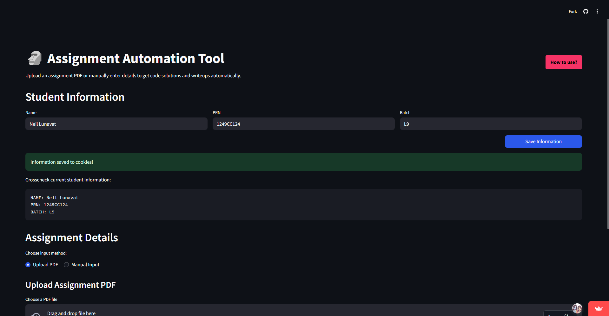

# 🗿 Assignment Automation Tool

  

## Transform Assignment Completion from Hours to Minutes

Upload your assignment PDF and get a complete solution with working code, theory explanations, and a submission-ready PDF in under 2 minutes.

## 🚀 How to Use

### Step 1: Enter Your Details

Fill in your name, PRN, and batch information in the sidebar. This information is saved for future assignments.

### Step 2: Upload Your Assignment PDF

Click "Browse files" to upload your assignment PDF (up to 5MB).

### Step 3: Process and Wait

Click "Process Assignment" and wait for the tool to:

-   Extract problem statements and theory points
-   Generate working code solutions
-   Test the code with multiple inputs
-   Create comprehensive theory writeups
-   Generate formatted PDFs

### Step 4: Download and Submit

Review your solution in the tabs and download your submission-ready PDF.

## 🧠 How It Works

  

### Information Extraction

The tool analyzes your PDF to extract key information:

  

### Solution Generation

AI generates working code and comprehensive explanations based on the extracted information.

### Final Output

Get everything you need in one place:

  

## ⚙️ Technology

-   **Streamlit** - Web interface
-   **Gemini AI** - Content generation and analysis
-   **PyPDF2** - PDF text extraction
-   **Markdown-to-PDF** - Document formatting
-   **Code Execution Engine** - Safe code testing

## 🛡️ Security Note

Don't worry - your code runs in an isolated environment. We're not stealing your revolutionary approach to printing "Hello World" or calculating Fibonacci sequences.

---

Made with caffeine and spite for all the assignments that robbed us of sleep. May future generations suffer less.

mwah

## 👨‍💻 About the Developer

This project was built by Neil Lunavat with ❣️. Connect with me on [LinkedIn](https://www.linkedin.com/in/neil-lunavat).
